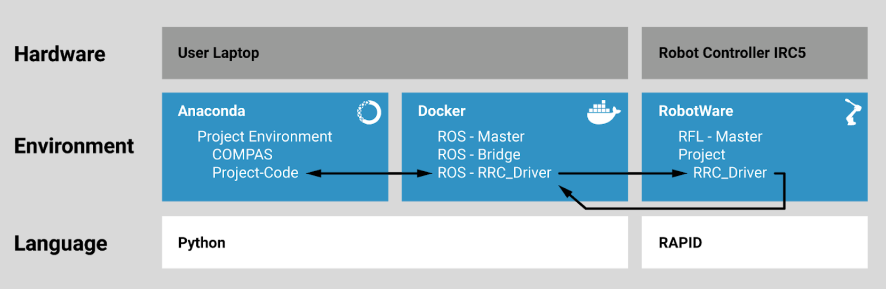

Getting started
===============

``COMPAS RRC`` provides an easy-to-use API to operate robots.
The system relies on 3 components: this library, a ROS RRC driver and
a vendor-specific RRC driver running on the robot controller.

A typical deployment of RRC uses Docker to simplify the setup:

For more details, check the `RRC course repository <https://github.com/compas-rrc/compas_rrc_course>`_.

API Reference
-------------

.. toctree::
   :maxdepth: 2

   concepts
   instructions
